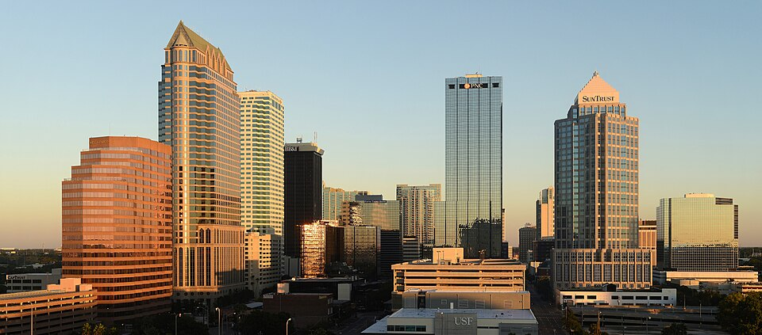

# 2026 Florida MODFLOW 6 & PEST++ Training

## Class materials for 2026 MODFLOW / PEST class in Tampa, Florida 

Tuesday January 20, 2026 8:00 AM - Friday January 23, 2026 2:00 PM

### <u>Tentative training agenda</u>:

#### __Tuesday - MODFLOW 6__
| Start Time | End Time  | | Topic |
| ---------- | -------- | - | ----- |
| 8:00 AM | 9:00 AM | **Presentation** | MODFLOW 6 Overview
| 9:00 AM | 9:30 AM | **Software installation** | testing and troubleshooting
| 9:30 AM| 11:00 AM | **Presentation Hands-on** | getting started with MODFLOW 6 and unstructured grids
| 11:00 AM | 12:00 PM | **Presentation Hands-on** | UZF and MVR
| 1:00 PM | 1:30 PM | **Presentation Hands-on** | MAW
| 1:30 PM | 3:00 PM | **Presentation Hands-on** | LAK and SFR
| 3:00 PM | 4:00 PM | **Presentation Hands-on** | PRT

#### __Wednesday - MODFLOW 6__
| Start Time | End Time  | | Topic |
| ---------- | -------- | - | ----- |
| 8:00 AM | 8:30 AM | **Presentation Hands-on** | variable density concepts and simulations 
| 8:30 AM | 9:00 AM | **Hands-on** | variable density concepts and simulations 
| 9:00 AM | 10:00 AM | **Presentation Hands-on** | parallel simulations 
| 10:00 AM | 11:00 AM | **Presentation Hands-on** | deep dive on solver settings
| 11:00 AM | 12:00 PM | **Presentation Hands-on** | MODFLOW 6 Application Programming Interface (API)
| 1:00 PM | 2:00 PM | **Presentation Hands-on** | MODFLOW 6 Adjoint (MF6-ADJ) and current and future MODFLOW 6 developments

#### __Thursday - PEST++__
| Start Time | End Time  | | Topic |
| ---------- | -------- | - | ----- |
|  8:00 AM | 9:00 AM | **Presentation** | calibration, parameters, predictions, and data
| 9:00 AM | 11:00 AM | **Hands-on** | setting up a pest interface manually. understanding parallelization concepts
| 11:00 AM | 12:00 PM | **Presentation** | pilot points, geostatistics, and heterogeneity
| 1:00 PM | 2:30 PM | **Hands-on** | automating pest interface construction, setting obs vals and weights
| 2:30 PM | 3:30 PM | **Presentation**  | ensemble methods
| 3:30 PM | 4:30 PM | **Hands-on** | initial ies run

#### __Friday - PEST++__
| Start Time | End Time  | | Topic |
| ---------- | -------- | - | ----- |
| 9:00 AM | 10:00 AM | **Hands-on** | running experiments with ies to understand how the prior, weights, and noise influence results
| 10:00 AM | 11:00 AM | **Presentation** | management optimization
| 11:00 AM | 12:00 PM | **Hands-on** | running experiments with opt to understand how bounds and constraints influence results
| 1:00 PM | 2:00 PM | **Discussion** | bring your questions!

